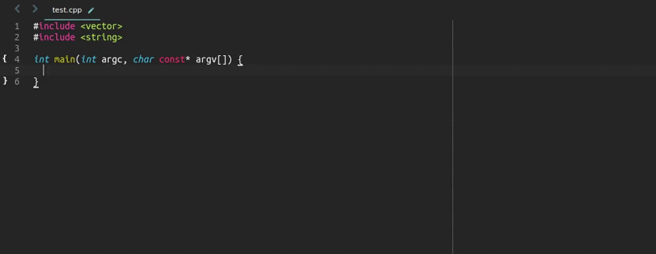

# EasyClangComplete #

Sublime Text 3 plugin that offers clang-based auto-completion for C++



|           Linux / OSX           |               Windows               |
|:-------------------------------:|:-----------------------------------:|
| [![Status][img-travis]][travis] | [![Status][img-appveyor]][appveyor] |

[![Release][img-release]][release]
[![Downloads][img-downloads]][downloads]
[![Codacy Badge][img-codacy]][codacy]
[![MIT licensed][img-mit]](./LICENSE)
[![Gitter][img-gitter]][gitter]

This plugin aims to provide easy-to-use, minimal-setup autocompletions for C++
for Sublime Text 3. [Support](#support-it) it if you like it.

**Build status is fine!**

Even if you see `failing` in Package Control.
Just click on the image to see correct build status. Sorry for inconvenience.

# Jump right in! #
Follow all the following steps to ensure the plugin works as expected!

## Install this plugin ##
- Best is to use [Package Control](https://packagecontrol.io/installation)
  + <kbd>CTRL</kbd>+<kbd>Shift</kbd>+<kbd>P</kbd> and install
    `EasyClangComplete`
- If you don't have Package Control (you should)
  + download one of the releases from
    [here](https://github.com/niosus/EasyClangComplete/releases).

## Install clang ##
- **Ubuntu**: `sudo apt-get install clang`
- **Windows**: install the latest release from `clang`
  [website](http://llvm.org/releases/download.html)
- **OSX**: ships `clang` by default. You are all set!
- on other systems refer to their package managers or install from `clang`
  [website](http://llvm.org/releases/download.html)

## Configure your includes ##
`Clang` will automatically search for headers in the folder that contains the
file you are working on and its parent. If you have a more sophisticated
project you will need to help `clang` just a little bit. There are three ways
to do it. Pick any of the following:

- Set `include_dirs` setting in `User Settings`:
  + see default [settings](EasyClangComplete.sublime-settings) to get started.
    These includes will be included in every project you run.
- Add `.clang_complete` file to the root of your project folder.
  + this file should contain all includes and macroses you want to use.
  + see example [.clang_complete](.clang_complete) file.
  + absolute paths start with `/`. All the others are treated as relative.
- Add all the flags to pass to clang to `*.sublime-project` file.
  + add all settings as a string list under `settings` -> `clang_flags`.
  + See example [sublime-project](easy_clang_complete.sublime-project#L22)
    file.
  + absolute paths start with `/`. All the others are treated as relative.

## You're good to go! ##

# More on the plugin #
All the essential information to make the plugin run is written above. If you
are still interested in more details - please read on.

## General info ##
The plugin has two modes:

- one that uses `libclang` with its python bindings. This is the better method
  as it fully utilizes saving compilation database which makes your completions
  blazingly fast. It is a default method for Linux and OSX. It is also unit
  tested to complete STL functions on both platforms. Please help me to bring
  it to Windows. Check out this [discussion][libclang-issue].
- one that parses the output from `clang -Xclang -code-completion-at` run from
  the command line. This is the default method for Windows. Tested on all
  platforms (see [Testing](#tests) part). Slower than method with `libclang`.
  Will be deprecated when we solve [issue #4][libclang-issue].

This plugin is intended to be easy to use. It should autocomplete STL out of
the box and you should just add the folders your project uses to `include_dirs`
list in the settings to make it autocomplete code all your project. If you
experience problems - create an issue. I will try to respond as soon as
possible.

## Commands ##
Here are some highlights for the commands. You can see all commands in command
pallet. Open it by pressing:

- Windows/Linux: <kbd>Ctrl</kbd> + <kbd>Shift</kbd> + <kbd>P</kbd>
- OSX: <kbd>Cmd</kbd> + <kbd>Shift</kbd> + <kbd>P</kbd>

All the commands of this plugin start with `EasyClangComplete:` and should be
self explanatory. Open an issue if they are not.


## Settings highlights ##
I will only cover most important settings here.

**PLEASE RESTART SUBLIME TEXT AFTER EACH SETTINGS CHANGE**

- `include_dirs`:
    + stores the locations where `clang` should be looking for external
      headers, e.g. `Boost`, `Ros`, `Eigen`, `OpenCV`, etc.
    + you can use placeholders like `$project_base_name` or
      `$project_base_path` to make includes more convenient.
    + it is absolutely ok to include a folder that does not exist. `clang`
      knows how to deal with it and it will neither break anything nor make
      things slower.
- `std_flag`:
    + sets the standard flag that will be used for compilation. Defaults to
      `std=c++11`
- `use_libclang`:
    + if `true` use libclang as backend.
    + if `false` or if first option failed, use output from `clang -Xclang
      -completion-at` command and parse it with regular expressions.
- `search_clang_complete_file`:
    + seach for `.clang_complete` file up the tree. Project folder is the last
      one to search for the file.
    + If the file is found, its contents of style `-I<some_local_path>` and
      `-I/<some_absolute_path>` (mind the `/` at the start of the line) are
      appended to include flags.
- `errors_on_save`:
    + highlight errors on save. A tooltip with an error message will be shown
      if the caret goes over a highlighted line.
- `triggers`:
    + defaults are `".", "::", "->"`. The autocompletion does not trigger on
      `>` or `:`. It also ignores float numbers like `3.14`.
    + For them to work, the Sublime Text completion triggers have to be
      configured too. These are already set to match triggers by default. You
      can also set these settings manually by copying the default ones defined
      [here](Preferences.sublime-settings) to your User Preferences and
      modifying them there.
- `use_project_specific_settings`:
    + when `true` will enforce sublime text to read all flags from project
      settings(`*.sublime-project` -> `settings` -> `clang_flags`). This
      settings overrides all other settings like `include_dirs` or `std_flag`
      so should be used with caution. Defaults to `false`. If the project
      settings cannot be found, the plugin will fall back to default behavior.
      An example settings entry looks like this:

      ```json
      {
        "settings":
        {
          "clang_flags":
          ["-std=c++11", "-Isrc", "-I/usr/include",]
        }
      }
      ```

Please see the default settings file in the repo for more settings
descriptions. Every setting in settings
[file](EasyClangComplete.sublime-settings) should have an understandable
comment. Should they not be clear - create an issue.

## Credits ##
The whole work seen here was originally a fork of another repository:
[ClangAutoComplete](https://github.com/pl-ca/ClangAutoComplete)

However, with time this plugin has grown quite different from its origin and
this is why you see it as a separate package now. Anyway, I encourage you to
check out what `ClangAutoComplete` has to offer and come back if you still like
this plugin more.

The trick with multiple `clang.cindex` files is inspired by this repo:
[clangHelper](https://github.com/griebd/clangHelper). Thanks for inspiration!

If you are an experienced python developer and find that something in my code
sucks completely - **DO** tell me. Python is not my main language and I am
always willing to learn.

Some functionality is there only because of the help of the following users:

- @Ventero for fixing `libclang` search on OSX
- @riazanovskiy for hints on `clang-3.8`

## Tests ##
I have tried to cover most crucial functionality with unit tests using
[UnitTesting](https://github.com/randy3k/UnitTesting) Sublime Text plugin.
Currently tests cover autocompletion of user struct and stl vector using clang
binary. To check out the current status click on relevant badge below:

|           Linux / OSX           |               Windows               |
|:-------------------------------:|:-----------------------------------:|
| [![Status][img-travis]][travis] | [![Status][img-appveyor]][appveyor] |

# Support it! #
[![Flattr this git repo][img-flattr]][donate-flattr]
[![Donate][img-paypal]][donate-paypal]

Current sponsor of this project is my sleep.
Please buy me a cup of tea if you appreciate the effort.


[release]: https://github.com/niosus/EasyClangComplete/releases
[downloads]: https://packagecontrol.io/packages/EasyClangComplete
[travis]: https://travis-ci.org/niosus/EasyClangComplete
[appveyor]: https://ci.appveyor.com/project/niosus/easyclangcomplete/branch/master
[codacy]: https://goo.gl/h52rHl
[gitter]: https://gitter.im/niosus/EasyClangComplete?utm_source=badge&utm_medium=badge&utm_campaign=pr-badge
[donate-paypal]: https://www.paypal.com/cgi-bin/webscr?cmd=_s-xclick&hosted_button_id=2QLY7J4Q944HS
[donate-flattr]: https://flattr.com/submit/auto?user_id=niosus&url=https://github.com/niosus/EasyClangComplete&title=EasyClangComplete&language=Python&tags=github&category=software
[libclang-issue]: https://github.com/niosus/EasyClangComplete/issues/4


[img-appveyor]: https://ci.appveyor.com/api/projects/status/4h4lfyomah06om2t/branch/master?svg=true
[img-travis]: https://travis-ci.org/niosus/EasyClangComplete.svg?branch=master
[img-codacy]: https://goo.gl/PDVYTj
[img-release]: https://img.shields.io/github/release/niosus/EasyClangComplete.svg?maxAge=3600
[img-downloads]: https://img.shields.io/packagecontrol/dt/EasyClangComplete.svg?maxAge=3600
[img-subl]: https://img.shields.io/badge/Sublime%20Text-3-green.svg
[img-mit]: https://img.shields.io/badge/license-MIT-blue.svg
[img-paypal]: https://img.shields.io/badge/Donate-PayPal-blue.svg
[img-flattr]: https://img.shields.io/badge/Donate-Flattr-blue.svg
[img-gitter]: https://badges.gitter.im/niosus/EasyClangComplete.svg
