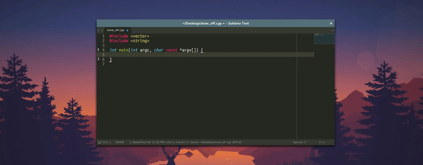

# EasyClangComplete #

Plugin for Sublime Text 3 for easy to use, out of the box autocompletions for
C, C++, Objective-C, and Objective-C++.



[![Release][img-release]][release]
[![Downloads Month][img-downloads]][downloads]
[![Travis Build][img-travis]][travis]
[![Windows Build][img-appveyor]][appveyor]
[![Codacy Badge][img-codacy]][codacy]
[![Coverage Badge][img-coverage]][coverage]
[![Donate][img-paypal]][donate-paypal]
[![Bountysource][img-bountysource]][bountysource-link]

# Jump right in! #
You are just three simple steps away!

## 1. Install this plugin ##
- Best is to use [Package Control](https://packagecontrol.io/installation)
  + <kbd>CTRL</kbd>+<kbd>Shift</kbd>+<kbd>P</kbd> and install
    `EasyClangComplete`
- If you don't have Package Control (you should)
  + download one of the releases from
    [here](https://github.com/niosus/EasyClangComplete/releases) and restart Sublime Text after unpacking.

## 2. Install clang ##
- **Ubuntu**        : `sudo apt-get install clang`
- **OSX**           : ships `clang` by default. You are all set!
- **Windows**       : install the latest release from clang website.
- **Other Systems** : use your package manager or install from clang website.
- clang website: http://llvm.org/releases/download.html

## 3. Configure your includes ##

### Using CMake? ###
Plugin will run cmake on a proper `CMakeLists.txt` in your project folder and
will use information from it to complete your code out of the box.

### Have a compilation database? ###
Plugin will search for a compilation database `compile_commands.json` in the
project folder and will load it to complete your code. If you want to specify a custom path to a comilation database you can do it in settings:
```json
"flags_sources": [
    {"file": "compile_commands.json", "search_in": "<YOUR_PATH>"},
  ],
```

### None of the above? ###
You will need a little bit of manual setup for now. `Clang` will automatically
search for headers in the folder that contains the file you are working on and
its parent. If you have a more sophisticated project you will need to help
`clang` just a little bit. There are three ways to do it.

Pick *ANY* of the following:

- Set include dirs in `"common_flags"` setting in `User Settings`:
  + See default [settings](EasyClangComplete.sublime-settings) to get started.
    These flags will be included in every project you run.
- Add `.clang_complete` file to the root of your project folder.
  + This file should contain all includes and macroses you want to use.
  + Example file contents:
  ```
  -Isrc
  -I/usr/include
  ```
- Override `"common_flags"` setting in your project file! Just define the same
  setting in project specific settings with either one of two prefixes:
  `"ecc_"` or `"easy_clang_complete_"`. See the project file in this repo for a
  working example. Minimal example for clarity:

  ```json
  {
    "settings":
    {
      "ecc_common_flags": ["-Isrc", "-I/usr/include"],
      "easy_clang_complete_verbose": true
    }
  }
  ```

These settings are prioritized in a configurable way. Check out the settings to
learn more about it.

## That's it! You're ready to use the plugin! ##

# More on the plugin #
All the essential information to make the plugin run is written above. If you
are still interested in more details - please read on.

## General info ##
The plugin uses `libclang` with its python bindings. This method fully utilizes
caching from `libclang` that makes your completions blazingly fast. It is unit
tested to complete STL functions on Linux, OSX and Windows platforms.

There is also a fallback mode if something is wrong with the `libclang` one
that parses the output from `clang -Xclang -code-completion-at` which is called
from the command line.

This plugin is intended to be easy to use. It should autocomplete STL out of
the box and is capable of working with multiple flag storages, such as a
compilation database or a `.clang_complete` file. If you experience problems -
create an issue. I will try to respond as soon as possible.

## Commands ##
Here are some highlights for the commands. You can see all commands in command
pallet. Open it by pressing:

- Windows/Linux: <kbd>Ctrl</kbd> + <kbd>Shift</kbd> + <kbd>P</kbd>
- OSX: <kbd>Cmd</kbd> + <kbd>Shift</kbd> + <kbd>P</kbd>

All the commands of this plugin start with `EasyClangComplete:` and should be
self explanatory. Open an issue if they are not.

## Settings ##

Please see the default settings [file](EasyClangComplete.sublime-settings)
shipped with the plugin for explanations and sane default values.

## Credits ##
The whole work seen here was originally a fork of another repository:
[ClangAutoComplete](https://github.com/pl-ca/ClangAutoComplete)

However, with time this plugin has grown quite different from its origin and
this is why you see it as a separate package now. Anyway, feel free to check
out what `ClangAutoComplete` has to offer and come back if you still like this
plugin more.

The trick with multiple `clang.cindex` files is inspired by this repo:
[clangHelper](https://github.com/griebd/clangHelper). Thanks for inspiration!

The progress indicator idea is from
[ColorSublime](https://github.com/Colorsublime/Colorsublime-Plugin) plugin.

Some functionality is there only because of the awesome contributors to this
project. To see their names plese check out the contributors page.

## Tests ##
Most crucial functionality is covered with unit tests using
[UnitTesting](https://github.com/randy3k/UnitTesting) Sublime Text plugin.

## Contributing ##
Contributions are welcome! Look at the issue list. If there is something you
think you can tackle, write about it in that issue and submit a Pull Request.

### Follow issue template! ###
Please follow the issue template *exactly* when creating a new issue.
I will be closing issues that do not follow that template. Please understand
that maintaining this codebase takes time and I expect at least well-formatted
issue statement to be able to tackle it. It is very demotivating to format 
the issues instead of the original submitter.

Please don't jump into creating a Pull Request straight away and open an issue
first. This way, we can synchronize our views on the problem, so that everyone
avoids losing time.

### Branches ###
There are two branches:
- `master`: should be stable and generally following the last release. Used for
  urgent bug fixing.
- `dev`: used to develop new features. Merges with master right before a new
  release.

### Code style ###
- Line width is `80` characters
- Every public function should be documented.
- The code *must* pass linters:
  + `pep8`
  + `pep257`: ignoring `["D209", "D203", "D204", "D213", "D406", "D407"]`

Please ensure, that your code conforms to this.

# Support it! #
[![Donate][img-paypal]][donate-paypal]
[![Flattr this git repo][img-flattr]][donate-flattr]
[![Bountysource][img-bountysource]][bountysource-link]
[![Beerpay][img-beerpay]][beerpay]

Current sponsor of this project is my sleep.
Please buy me a cup of tea if you appreciate the effort.

Also, pull requests are welcome! And don't forget to tell people about this
plugin! The more people use it - the merrier.

### Contributors

This project exists thanks to all the people who contribute. [[Contribute](CONTRIBUTING.md)].
<a href="graphs/contributors"></a><a href="https://opencollective.com/EasyClangComplete#backers" target="_blank"></a>

### Sponsors

Support this project by becoming a sponsor. Your logo will show up here with a link to your website. [[Become a sponsor](https://opencollective.com/EasyClangComplete#sponsor)]

<a href="https://opencollective.com/EasyClangComplete/sponsor/0/website" target="_blank"></a>
<a href="https://opencollective.com/EasyClangComplete/sponsor/1/website" target="_blank"></a>
<a href="https://opencollective.com/EasyClangComplete/sponsor/2/website" target="_blank"></a>
<a href="https://opencollective.com/EasyClangComplete/sponsor/3/website" target="_blank"></a>
<a href="https://opencollective.com/EasyClangComplete/sponsor/4/website" target="_blank"></a>
<a href="https://opencollective.com/EasyClangComplete/sponsor/5/website" target="_blank"></a>
<a href="https://opencollective.com/EasyClangComplete/sponsor/6/website" target="_blank"></a>
<a href="https://opencollective.com/EasyClangComplete/sponsor/7/website" target="_blank"></a>
<a href="https://opencollective.com/EasyClangComplete/sponsor/8/website" target="_blank"></a>
<a href="https://opencollective.com/EasyClangComplete/sponsor/9/website" target="_blank"></a>


                         ╔═╗┌─┐┌─┐┬ ┬  ╔═╗┬  ┌─┐┌┐┌┌─┐  ╔═╗┌─┐┌┬┐┌─┐┬  ┌─┐┌┬┐┌─┐
                         ║╣ ├─┤└─┐└┬┘  ║  │  ├─┤││││ ┬  ║  │ ││││├─┘│  ├┤  │ ├┤
                         ╚═╝┴ ┴└─┘ ┴   ╚═╝┴─┘┴ ┴┘└┘└─┘  ╚═╝└─┘┴ ┴┴  ┴─┘└─┘ ┴ └─┘

[release]: https://github.com/niosus/EasyClangComplete/releases
[downloads]: https://packagecontrol.io/packages/EasyClangComplete
[travis]: https://travis-ci.org/niosus/EasyClangComplete
[appveyor]: https://ci.appveyor.com/project/niosus/easyclangcomplete/branch/master
[codacy]: https://www.codacy.com/app/zabugr/EasyClangComplete/dashboard
[coverage]: https://www.codacy.com/app/zabugr/EasyClangComplete/dashboard
[gitter]: https://gitter.im/niosus/EasyClangComplete?utm_source=badge&utm_medium=badge&utm_campaign=pr-badge
[donate-paypal]: https://www.paypal.com/cgi-bin/webscr?cmd=_s-xclick&hosted_button_id=2QLY7J4Q944HS
[donate-flattr]: https://flattr.com/submit/auto?user_id=niosus&url=https://github.com/niosus/EasyClangComplete&title=EasyClangComplete&language=Python&tags=github&category=software
[libclang-issue]: https://github.com/niosus/EasyClangComplete/issues/88
[cmake-issue]: https://github.com/niosus/EasyClangComplete/issues/19
[bountysource-link]: https://www.bountysource.com/teams/easyclangcomplete
[beerpay]: https://beerpay.io/niosus/EasyClangComplete
[gratipay]: https://gratipay.com/EasyClangComplete/
[maintainerd]: https://github.com/divmain/maintainerd

[img-gratipay]: https://img.shields.io/gratipay/user/niosus.svg?style=flat-square
[img-beerpay]: https://beerpay.io/niosus/EasyClangComplete/badge.svg?style=flat-square
[img-bountysource]: https://img.shields.io/bountysource/team/easyclangcomplete/activity.svg?style=flat-square
[img-appveyor]: https://img.shields.io/appveyor/ci/niosus/easyclangcomplete/master.svg?style=flat-square&label=windows
[img-travis]: https://img.shields.io/travis/niosus/EasyClangComplete/master.svg?style=flat-square&label=linux%20|%20osx
[img-codacy]: https://img.shields.io/codacy/grade/254f8db44b004dffa76b8cebfece4c06.svg?style=flat-square
[img-coverage]: https://img.shields.io/codacy/coverage/254f8db44b004dffa76b8cebfece4c06.svg?style=flat-square
[img-release]: https://img.shields.io/github/release/niosus/EasyClangComplete.svg?style=flat-square
[img-downloads]: https://img.shields.io/packagecontrol/dt/EasyClangComplete.svg?maxAge=3600&style=flat-square
[img-downloads-month]: https://img.shields.io/packagecontrol/dm/EasyClangComplete.svg?maxAge=2592000&style=flat-square
[img-subl]: https://img.shields.io/badge/Sublime%20Text-3-green.svg?style=flat-square
[img-mit]: https://img.shields.io/badge/license-MIT-blue.svg?style=flat-square
[img-paypal]: https://img.shields.io/badge/Donate-PayPal-blue.svg?style=flat-square
[img-flattr]: https://img.shields.io/badge/Donate-Flattr-blue.svg?style=flat-square
[img-gitter]: https://badges.gitter.im/niosus/EasyClangComplete.svg?style=flat-square


